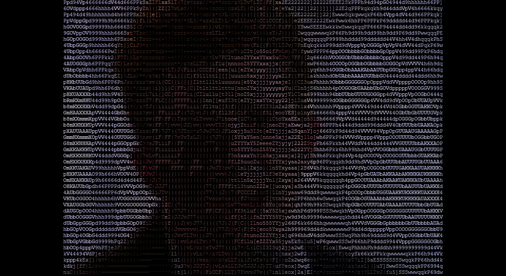

# VSCII

A browser-based ASCII video player built with Next.js.


## Features

- Drag and drop any video file — MP4, MKV, MOV, WebM, AVI
- Real-time ASCII rendering synced frame-for-frame to audio playback
- Adjustable detail level — slide between abstract and high resolution
- Color modes — full color, grayscale, red, green, blue, amber, or custom
- Replay instantly without re-uploading
- Record and download clips as WebM with audio
- Right-click any frame to save it as an image

| Detail slider | Color modes | Frame capture |
|---|---|---|
|  |  |  |

## Requirements

- [Node.js](https://nodejs.org) 18+
- [FFmpeg](https://ffmpeg.org/download.html) installed and on your PATH
  - Mac: `brew install ffmpeg`
  - Windows: [download from ffmpeg.org](https://ffmpeg.org/download.html) and add to PATH
  - Linux: `sudo apt install ffmpeg`

## Getting started

```bash
git clone https://github.com/jwkinney443/vscii
cd vscii
npm install
npm run build
npm start
```

Open [http://localhost:3000](http://localhost:3000) and drop in a video file.

> **Note:** `npm run dev` works too but has a slow first-load compilation. The build + start flow above is recommended for normal use.

## Scripts

| Command | Description |
|---|---|
| `npm run dev` | Start the development server |
| `npm run build` | Build for production |
| `npm start` | Start the production server |

## How it works

When you drop a video file, it's streamed over WebSocket to a local Node.js server. FFmpeg decodes the video into raw RGB frames and extracts the audio. Each frame is mapped to ASCII characters by luminance and rendered to an HTML canvas. A `requestAnimationFrame` loop keeps the canvas in sync with the audio element's `currentTime`. Recording combines `canvas.captureStream()` with an `AudioContext` media stream destination fed into the `MediaRecorder` API.

## Architecture

```
Browser                          Node.js Server
──────────────────────────────   ──────────────────────────────
  Drop video file
       │
       │  WebSocket (binary chunks)
       ▼
  WS Client ──────────────────►  WS Server
                                      │
                                      │  stdin pipe
                                      ▼
                                   FFmpeg
                                   ├── video → raw RGB frames (stdout)
                                   └── audio → .wav file
                                      │
                                      │  WebSocket (frame buffers)
       ◄──────────────────────────────┘
       │
  Frame buffer (queue)
       │
  requestAnimationFrame
  loop (keyed to audio.currentTime)
       │
       ▼
  Canvas 2D — luminance → ASCII char + color
       │
       ├── canvas.captureStream()  ─┐
       └── AudioContext stream      ├──► MediaRecorder → .webm download
                                   ─┘
```

## Stack

- [Next.js](https://nextjs.org) — framework
- [ws](https://github.com/websockets/ws) — WebSocket server
- [FFmpeg](https://ffmpeg.org) — video decoding and audio extraction
- Canvas API — ASCII frame rendering
- MediaRecorder API — clip recording with audio
- [Tailwind CSS](https://tailwindcss.com) — styling
